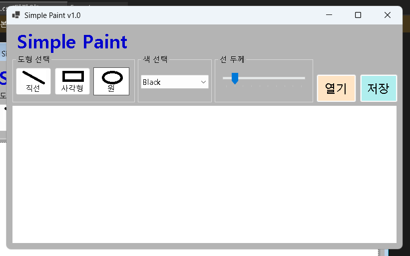
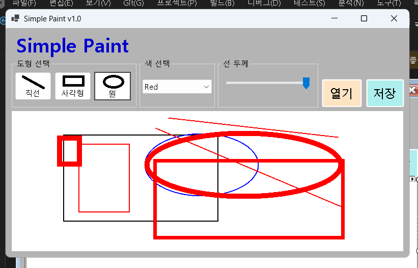

# (C# 코딩) SimplePaint

## 개요

* C# 프로그래밍 학습
* 1줄 소개: 마우스 드래그를 이용해 도형을 그리고 색상과 선 굵기를 조절하며, 이미지를 저장하고 불러와 추가 작업이 가능한 간단한 그림판 프로그램
* 사용한 플랫폼:

  * C#, .NET Windows Forms, Visual Studio, GitHub
* 사용한 컨트롤:

  * 입력: Button (도형 선택, 파일 열기/저장), ComboBox (색상 선택), TrackBar (선 굵기 조절)
  * 출력: PictureBox (그림 그리기 캔버스)
  * 기타: Label (설명 및 UI 구성)
* 사용한 기술과 구현한 기능:

  * Bitmap 및 Graphics 객체를 활용한 메모리 기반 캔버스 구현
  * MouseDown, MouseMove, MouseUp 이벤트를 이용한 드래그 기반 도형 그리기
  * Paint 이벤트를 활용한 실시간 점선 미리보기 기능 구현
  * Pen 객체를 이용한 색상 및 선 두께 적용
  * ComboBox와 TrackBar를 통한 사용자 입력 상태 관리
  * SaveFileDialog를 이용한 이미지 저장 기능 구현 (.png, .jpg, .bmp)
  * OpenFileDialog를 이용한 외부 이미지 불러오기 기능 구현
  * 다양한 방향 드래그에서도 정상 동작하도록 Rectangle 계산 로직 적용

## 실행 화면 (과제1)

* 과제1 코드의 실행 스크린샷
  

* 과제 내용 (위 그림 참조)

  * 기본 UI 구성 및 도형 선택, 색상 선택, 선 굵기 조절 기능 구현
  * 각 컨트롤의 역할을 명확히 나누어 사용자 인터페이스 설계

* 구현 내용과 기능 설명 (위 그림 참조)

  * Button을 이용하여 직선, 사각형, 원을 선택할 수 있도록 구현했다.
    사용한 코드: `currentTool = ToolType.Line;`
  * ComboBox의 SelectedIndexChanged 이벤트를 활용하여 색상 선택 기능을 구현했다.
    사용한 코드: `cmbColor.SelectedIndexChanged += cmbColor_SelectedIndexChanged;`
  * TrackBar의 ValueChanged 이벤트를 이용해 선 굵기를 조절하도록 구현했다.
    사용한 코드: `currentLineWidth = trbLineWidth.Value;`
  * 현재 선택된 도형, 색상, 선 굵기를 변수로 관리하여 이후 그리기 기능과 연동되도록 설계했다.

## 실행 화면 (과제2)

* 과제2 코드의 실행 스크린샷
  

* 과제 내용 (위 그림 참조)

  * 마우스 드래그를 이용한 도형 그리기 기능 구현
  * 드래그 중 실시간 미리보기 기능 추가

* 구현 내용과 기능 설명 (위 그림 참조)

  * MouseDown, MouseMove, MouseUp 이벤트를 이용하여 드래그 상태를 관리했다.
    사용한 코드: `isDrawing = true; startPoint = e.Location;`
  * 드래그 시작점과 끝점을 기준으로 도형을 그리도록 구현했다.
    사용한 코드: `DrawShape(canvasGraphics, pen, startPoint, endPoint);`
  * Paint 이벤트를 활용하여 드래그 중 점선 형태의 미리보기 도형을 출력했다.
    사용한 코드: `pen.DashStyle = DashStyle.Dash;`
  * Rectangle 계산 함수를 통해 모든 방향에서 정상적으로 도형이 그려지도록 처리했다.
    사용한 코드: `Math.Min(), Math.Abs()`